# EatMe

EatMe is a Flutter food decision engine for Android and iOS: **your recipes, your fridge, your diet, one decision**. ChefTable decides, Fridge tracks what is available, Plan organizes what comes next, and Profile controls how EatMe adapts. A Python API owns dietary validation, entitlements and inventory transactions. A Next.js studio manages catalog and evidence review.

## Screenshots

ChefTable, Fridge, Plan and Profile in light and dark themes. These are actual Flutter widget-test renders of the premium UI with isolated demonstration data, captured at 390 × 844 with bundled EatMe fonts. The food images are AI-generated illustrations bundled with the demo catalog; they do not represent a user's food or recognition results.

| Light theme | Dark theme |
| :---: | :---: |
| 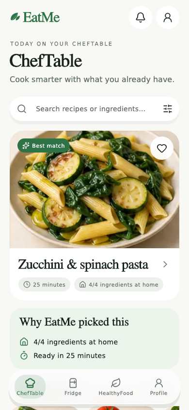 | 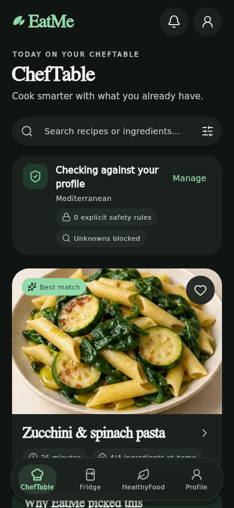 |
| 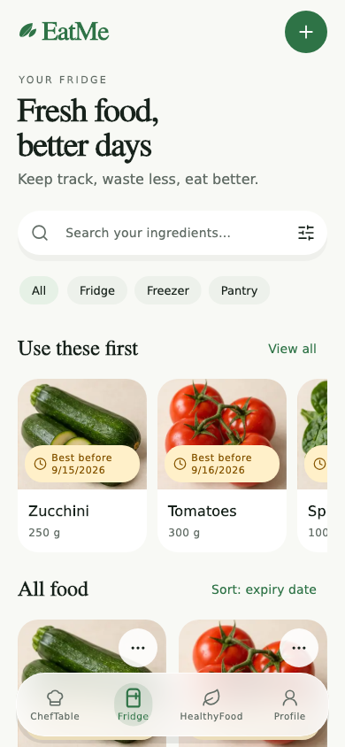 | 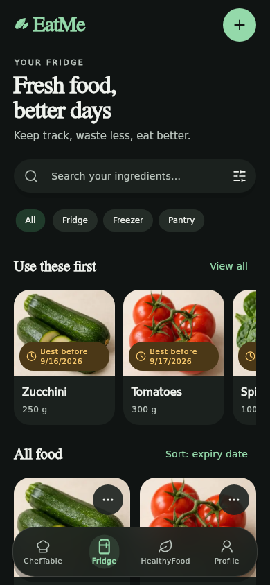 |
|  |  |
| 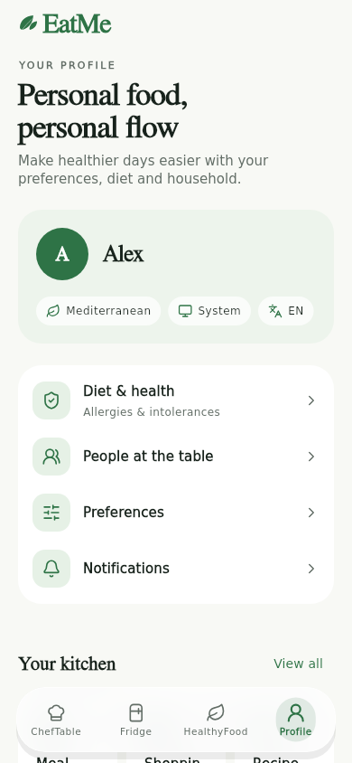 | 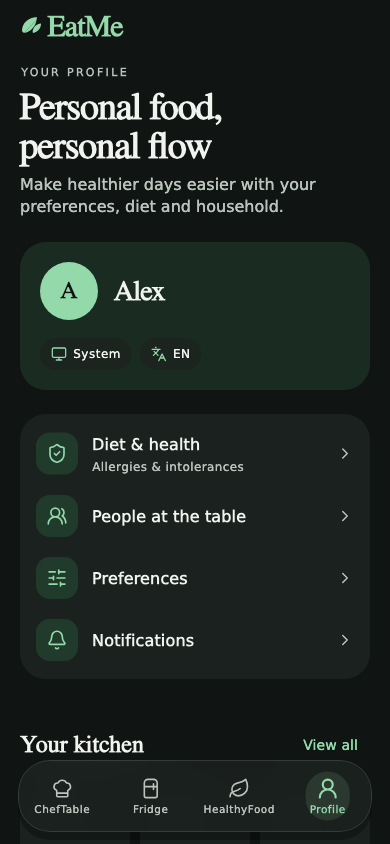 |

The images are stored in this repository, so they remain available after CI artifacts expire. To regenerate them, run `flutter test test/visual_reference_test.dart test/premium_journeys_test.dart test/reference_features_test.dart test/social_recipe_import_test.dart` from `apps/mobile` with `FLUTTER_ROOT` pointing to the Flutter SDK; PNG renders are written to `build/screenshots/`. The committed copies are the original PNG renders without resizing. The tests also exercise 1.6× text scaling, compact Italian layouts, secondary journeys and persistent allergy warnings. See the [visual design notes](docs/product/visual-design.md) for the reference direction and asset provenance.

The [functional reconciliation CI](https://github.com/FilippoCinotti/EatMe/actions/runs/34776802964) passed API, database, studio and Flutter checks, both native debug builds, and the real API Android emulator workflow before the premium presentation changes. PR #15 delivered the validated functional and premium baseline; the final visual-fidelity pass is tracked in [PR #16](https://github.com/FilippoCinotti/EatMe/pull/16). See the [verification report](docs/product/verification.md) for precise tested commits and external store-release gates.

### Connected journeys

| Welcome | Recipe detail |
| :---: | :---: |
| 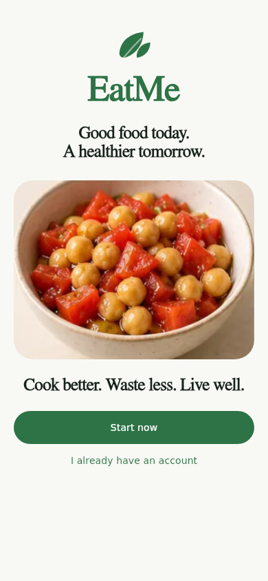 | 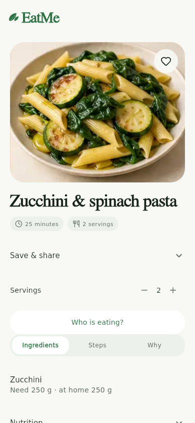 |

See the [complete screenshot gallery](docs/screenshots/README.md) for login, sign-up, diet and health, preferences, notifications, household, privacy, filters and both add-food stages in both themes.

## Reference feature additions

| New light-theme flows | New dark-theme flows |
| :---: | :---: |
| 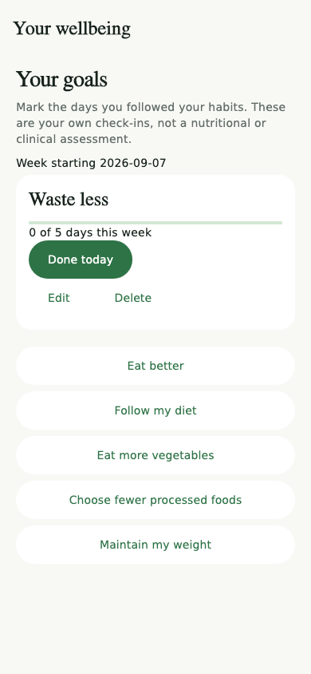 | 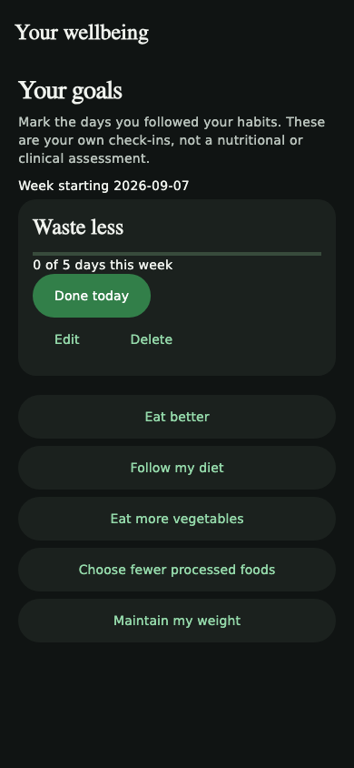 |
| 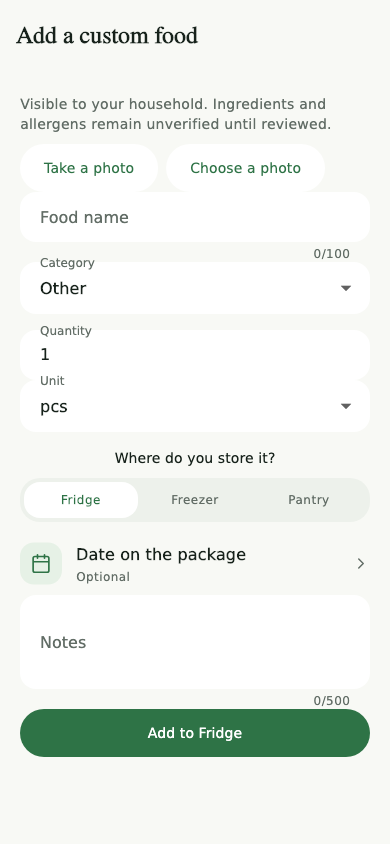 | 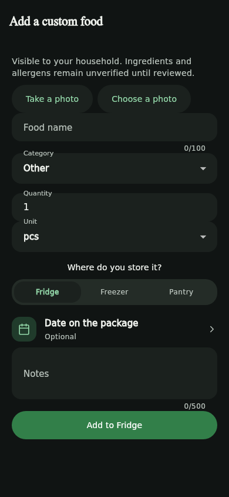 |
| 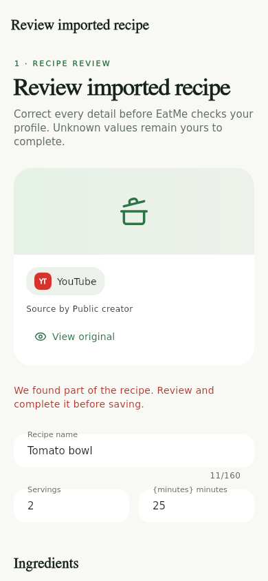 | 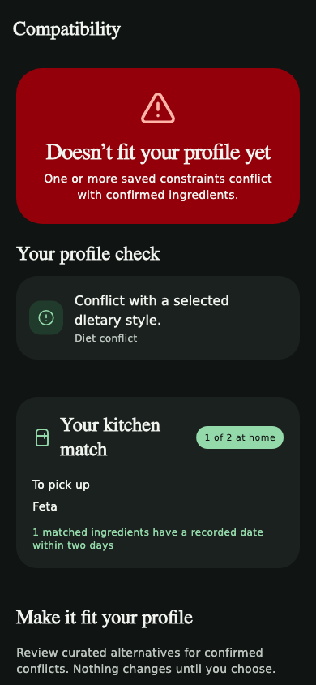 |
| 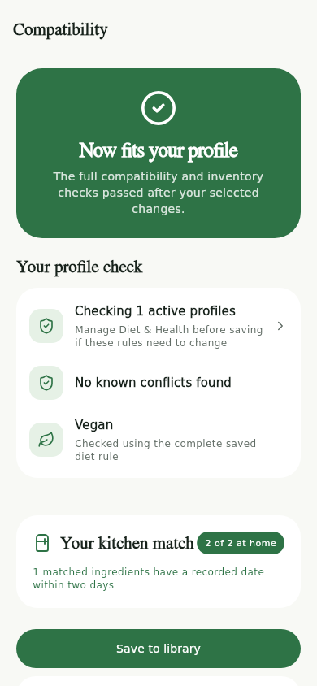 | 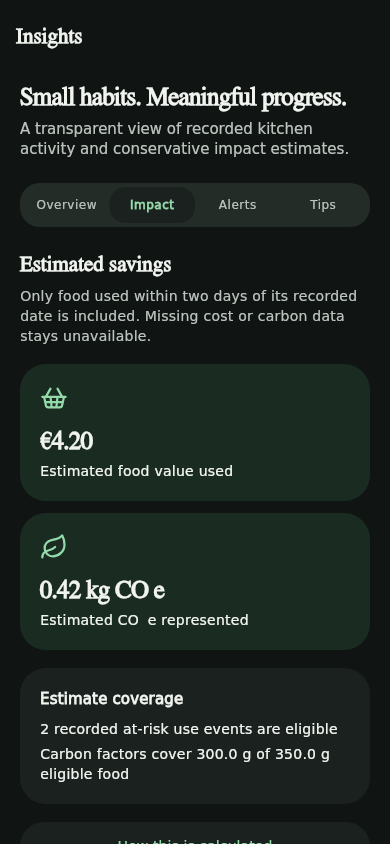 |

These images are real Flutter test renders with fixture data, generated by the reference and social-import suites at 390 × 844. They have also passed layout checks at 1.6× text scaling and in compact Italian layouts.

The current feature branch adds custom household foods with private photos, food favorites, weekly habit check-ins, photo acquisition, reviewed public YouTube/Instagram recipe import, canonical ingredient mapping, full diet/safety assessment, curated user-selected substitutions with complete re-check, deterministic estimated savings, an expiry browser, pantry sorting, category-grouped shopping and sharing, complete scan date/storage review, external leftover entry, configurable cooking timers, a completion screen and recent household activity. See the [feature coverage and API contracts](docs/product/reference-feature-parity.md) for implementation details and explicit provider/data limitations.

The valid feature work was preserved on the same branch before redesigning its presentation. The [Phase 0 record](docs/product/premium-redesign-reconciliation.md) explains branch reconciliation and verification.

## Run on a simulator

Install **Flutter 3.47.2**, **Python 3.12**, and Git. Android development also needs Android Studio, an Android SDK/emulator and JDK 17. iOS development needs a Mac with Xcode, its simulator runtimes and CocoaPods where required by Flutter plugins.

```bash
git clone https://github.com/FilippoCinotti/EatMe.git
cd EatMe
python -m pip install -e 'services/api[dev]'
python scripts/dev.py
```

In a second terminal, resolve the locked dependencies and start an emulator:

```bash
python scripts/bootstrap_mobile.py
cd apps/mobile
flutter doctor -v
flutter devices
# Android emulator: 10.0.2.2 reaches the host computer.
flutter run -d YOUR_ANDROID_DEVICE_ID --dart-define=API_URL=http://10.0.2.2:8000/api/v1
# iOS simulator on macOS:
flutter run -d YOUR_IOS_SIMULATOR_ID --dart-define=API_URL=http://127.0.0.1:8000/api/v1
```

Register a development account in the app. Local authentication and demonstration catalog content are isolated from production. Press `r` in the Flutter terminal for hot reload or use the Flutter extension in VS Code/Android Studio.

## Application workflows

- **ChefTable:** decision-first, constraint-aware suggestions, recipe detail, social import, favorites, feedback and guided cooking.
- **Fridge:** individual batches, quantities, locations, dates, stock events, barcode products, confirmed photo/receipt imports and leftovers.
- **Plan:** week and meal slots, Dinner events with private guest RSVP and group Diet-Fit, Smart Plan, Shopping and purchase-to-Fridge reconciliation.
- **Profile:** dietary consent, household membership, preferences, reminders, export, deletion and offline synchronization.
- **Diet & Health:** structured eating styles, allergies, intolerances, sensitivities, medical awareness, reviewed protocols, ethical/religious preferences, meal timing and explicit uncertainty.
- **Editorial studio:** drafts, independent review, publication, deprecation, reports, feature flags and audit history.

The canonical catalog is deliberately small in development. Unknown ingredients and unavailable scientific rules fail closed. RAD and other uncurated clinical profiles cannot be activated by a language-model answer.

## Repository

| Path | Responsibility |
| --- | --- |
| `apps/mobile` | Flutter UI and device integrations |
| `services/api/eatme` | Authentication boundary, domain services, recommendation engine and persistence |
| `services/worker` | Durable processing jobs and media retention |
| `apps/admin` | Editorial studio and public privacy/deletion pages |
| `apps/guest` | No-login, localized Dinner RSVP web app |
| `supabase/migrations` | Versioned PostgreSQL schema and access policies |
| `services/api/tests` | Domain, HTTP, privacy, concurrency and processing tests |
| `docs` | Product, architecture, setup, verification and release documentation |

## Configuration and release

Copy `.env.example` to a local environment file and load it with your process manager. The scripts do not silently load arbitrary environment files. Configure external providers only when you intend to use them. No secret key belongs in the mobile app.

Read [local development](docs/development/local-setup.md), [provider setup](docs/development/providers.md), [release process](docs/releases/release-process.md), and [verification](docs/product/verification.md). Store publication requires live backend configuration, signing accounts, public legal/support resources and device validation; source delivery alone does not satisfy those gates.

Product architecture and commercial boundaries are documented in [Food Decision Engine](docs/product/food-decision-engine.md), [Free vs EatMe+](docs/product/free-vs-eatme-plus.md), and [Diet & Health safety](docs/product/diet-health-safety.md).
The frozen Dinner/Guest contract, privacy boundaries and release checks are documented in [Dinner and guest RSVP](docs/product/dinner-guests.md).

All documentation, source comments and new GitHub review text are maintained in English. User-facing mobile strings support English and Italian.
