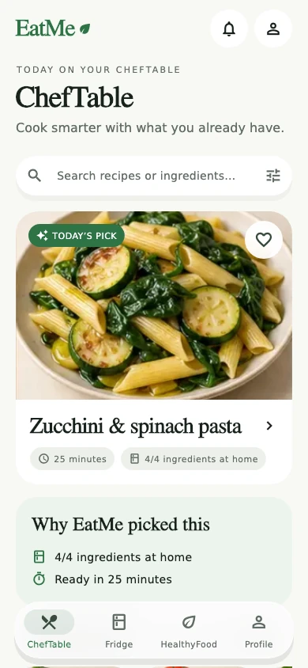
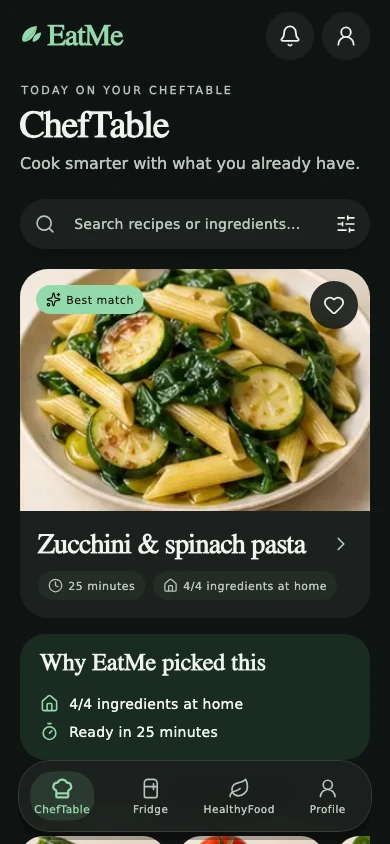
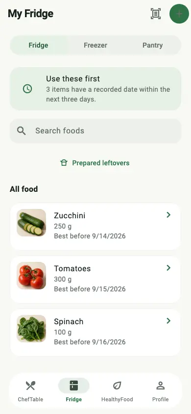
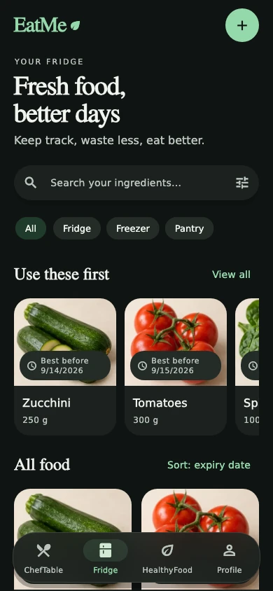
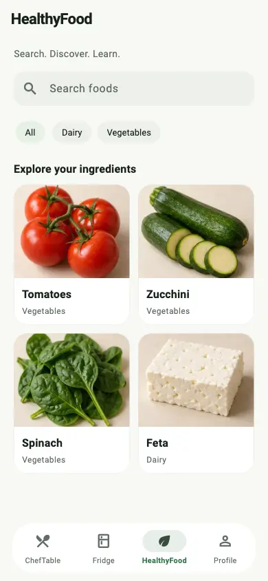
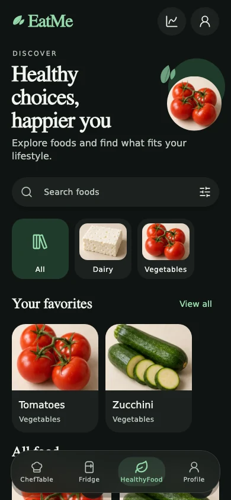
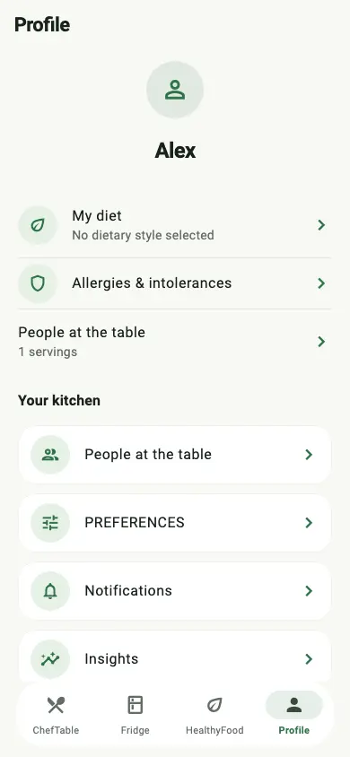
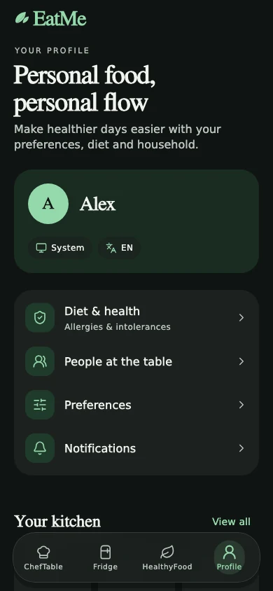

# EatMe

EatMe is a Flutter application for Android and iOS that connects household food inventory, recipe discovery, cooking, shopping and meal planning. A Python API owns dietary validation and inventory transactions. A Next.js studio manages catalog and evidence review.

## Screenshots

ChefTable, Fridge, HealthyFood and Profile in light and dark themes. These are actual Flutter widget-test renders with demonstration data, captured at 390 × 844 with real fonts. The food images are AI-generated illustrations bundled with the demo catalog; they do not represent a user's food or recognition results.

| Light theme | Dark theme |
| :---: | :---: |
|  |  |
|  |  |
|  |  |
|  |  |

The images are stored in this repository, so they remain available after CI artifacts expire. To regenerate them, run `flutter test test/visual_reference_test.dart` from `apps/mobile` with `FLUTTER_ROOT` pointing to the Flutter SDK; PNG renders are written to `build/screenshots/`. The README copies are encoded as WebP without resizing. The tests also exercise all four screens at 1.6× text scaling. See the [visual design notes](docs/product/visual-design.md) for the reference direction and asset provenance.

The [verified visual refresh CI](https://github.com/FilippoCinotti/EatMe/actions/runs/34739280871) passed API, database, studio and Flutter checks, both native debug builds, and the real API Android emulator workflow. See the [verification report](docs/product/verification.md) for the tested commit and remaining store release gates.

## Reference feature additions

The current feature branch adds custom household foods with private photos, food favorites, weekly habit check-ins, an expiry browser, pantry sorting, category-grouped shopping and sharing, complete scan date/storage review, external leftover entry, configurable cooking timers, a completion screen and recent household activity. See the [feature coverage and API contracts](docs/product/reference-feature-parity.md) for implementation details and explicit provider/data limitations.

The screenshots and successful visual-refresh run above describe the previously verified baseline. New feature validation is tracked in [PR #15](https://github.com/FilippoCinotti/EatMe/pull/15).

## Run on a simulator

Install **Flutter 3.47.2**, **Python 3.12**, and Git. Android development also needs Android Studio, an Android SDK/emulator and JDK 17. iOS development needs a Mac with Xcode, its simulator runtimes and CocoaPods where required by Flutter plugins.

```bash
git clone --branch feat/reference-features https://github.com/FilippoCinotti/EatMe.git
cd EatMe
python -m pip install -e 'services/api[dev]'
python scripts/dev.py
```

In a second terminal, resolve the locked dependencies and start an emulator:

```bash
python scripts/bootstrap_mobile.py
cd apps/mobile
flutter doctor -v
flutter devices
# Android emulator: 10.0.2.2 reaches the host computer.
flutter run -d YOUR_ANDROID_DEVICE_ID --dart-define=API_URL=http://10.0.2.2:8000/api/v1
# iOS simulator on macOS:
flutter run -d YOUR_IOS_SIMULATOR_ID --dart-define=API_URL=http://127.0.0.1:8000/api/v1
```

Register a development account in the app. Local authentication and demonstration catalog content are isolated from production. Press `r` in the Flutter terminal for hot reload or use the Flutter extension in VS Code/Android Studio.

## Application workflows

- **ChefTable:** constraint-aware suggestions, recipe detail, favorites, feedback, private imports, ingredient substitution drafts and guided cooking.
- **Fridge:** individual batches, quantities, locations, dates, stock events, barcode products, confirmed photo/receipt imports and leftovers.
- **HealthyFood:** ingredient compatibility, source-attributed nutrition where available, and approved evidence retrieval.
- **Profile:** dietary consent, household membership, preferences, reminders, export, deletion and offline synchronization.
- **Shopping and planning:** weekly meal slots, automatic dinner suggestions, usable-stock deficit calculation, purchase-to-inventory transactions and concurrency checks.
- **Editorial studio:** drafts, independent review, publication, deprecation, reports, feature flags and audit history.

The canonical catalog is deliberately small in development. Unknown ingredients and unavailable scientific rules fail closed. RAD and other uncurated clinical profiles cannot be activated by a language-model answer.

## Repository

| Path | Responsibility |
| --- | --- |
| `apps/mobile` | Flutter UI and device integrations |
| `services/api/eatme` | Authentication boundary, domain services, recommendation engine and persistence |
| `services/worker` | Durable processing jobs and media retention |
| `apps/admin` | Editorial studio and public privacy/deletion pages |
| `supabase/migrations` | Versioned PostgreSQL schema and access policies |
| `services/api/tests` | Domain, HTTP, privacy, concurrency and processing tests |
| `docs` | Product, architecture, setup, verification and release documentation |

## Configuration and release

Copy `.env.example` to a local environment file and load it with your process manager. The scripts do not silently load arbitrary environment files. Configure external providers only when you intend to use them. No secret key belongs in the mobile app.

Read [local development](docs/development/local-setup.md), [provider setup](docs/development/providers.md), [release process](docs/releases/release-process.md), and [verification](docs/product/verification.md). Store publication requires live backend configuration, signing accounts, public legal/support resources and device validation; source delivery alone does not satisfy those gates.

All documentation, source comments and new GitHub review text are maintained in English. User-facing mobile strings support English and Italian.
