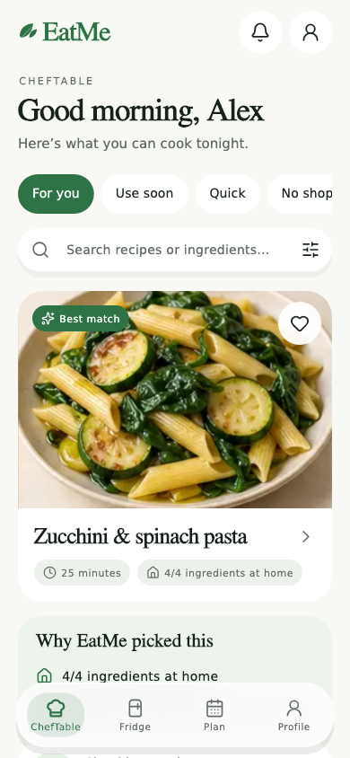
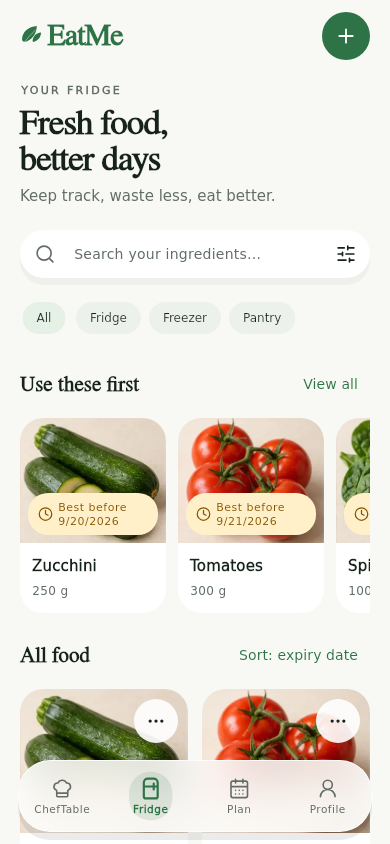
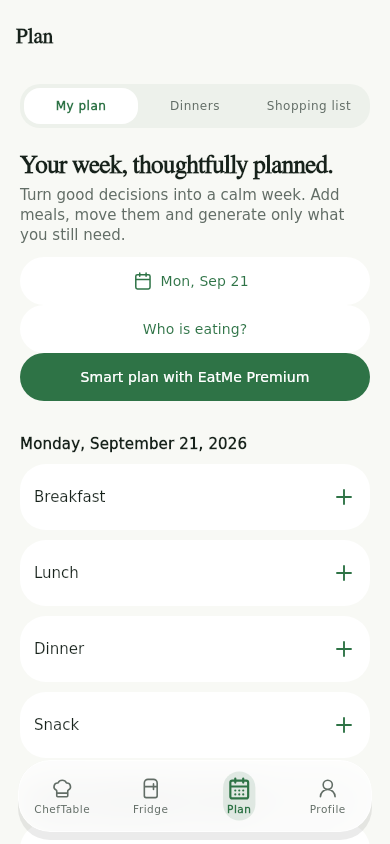
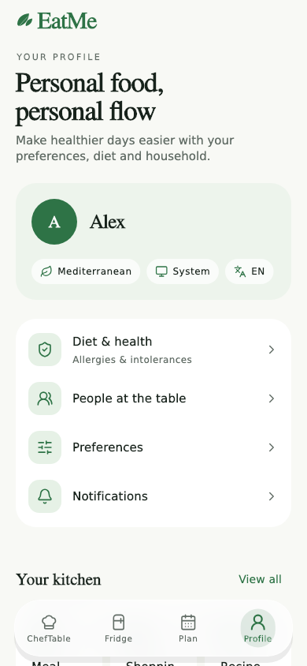

# EatMe+

**Smarter meals, less effort.** EatMe+ is a Flutter app for iOS and Android that helps people decide what to eat using their recipes, household inventory, dietary profile and weekly plans.

The product is built around four connected areas: **ChefTable** recommends what fits now, **Fridge** tracks what is available, **Plan** organizes meals and shopping, and **Profile** controls household, dietary and safety preferences.

## Product highlights

- **Personalized recommendations** — recipe suggestions consider tastes, meal context, household inventory and dietary constraints.
- **Smart recipe import** — import from supported public sources, review normalized ingredients, run Diet-Fit checks and approve substitutions before saving.
- **Fridge, freezer and pantry** — track batches, quantities, locations and dates; add food by barcode, photo, receipt or manual entry.
- **Weekly planning and shopping** — build a meal plan, generate a category-grouped shopping list and move purchased items into Fridge.
- **Dinner and guests** — plan shared meals, collect private guest preferences and adapt servings without exposing health data.
- **Diet and safety** — model eating styles, allergies, intolerances, sensitivities, ethical or religious preferences and reviewed health protocols. Unknown ingredients fail closed.
- **Flexible eating** — support flexible meals, personal goals, weekly check-ins and Guilty Pleasure mode without weakening hard safety rules.
- **EatMe Premium** — unlimited supported imports, advanced mapping and adaptations, advanced weekly planning and shopping generation, plus receipt and photo tools.

## Screenshots

| ChefTable | Fridge |
| :---: | :---: |
|  |  |

| Plan | Profile |
| :---: | :---: |
|  |  |

The committed screenshots are real Flutter widget-test renders with isolated fixture data. See the [complete gallery](docs/screenshots/README.md) for light and dark themes, onboarding, recipe import, Diet-Fit, shopping, household and accessibility states.

## Architecture

| Path | Responsibility |
| --- | --- |
| `apps/mobile` | Flutter mobile app and device integrations |
| `services/api/eatme` | Python API, authentication boundary, recommendation engine and domain services |
| `services/worker` | Durable processing jobs and media retention |
| `apps/admin` | Protected editorial studio |
| `apps/public` | Public website, legal pages, support and account deletion |
| `apps/guest` | Localized, no-login Dinner RSVP experience |
| `supabase/migrations` | Versioned PostgreSQL schema and access policies |
| `docs` | Product, architecture, setup, verification and release documentation |

Production uses **Supabase** for PostgreSQL and authentication, a **Render** API and worker, **RevenueCat** for mobile entitlements, and **Firebase Crashlytics** for crash reporting. The mobile client never contains server secrets.

## Languages

The mobile app and Guest RSVP support:

- English (United States)
- Italian
- Spanish (Spain)
- French
- German
- Simplified Chinese

`scripts/check_localizations.py` runs in CI and enforces full key and placeholder parity. Recipe and food catalog content is currently authored in English and Italian; other locales may display English catalog content.

## Run locally

Requirements:

- Flutter 3.47.2 and its bundled Dart SDK
- Python 3.12
- Git
- Android Studio, Android SDK/emulator and JDK 17 for Android
- macOS, Xcode and CocoaPods where required for iOS

```bash
git clone https://github.com/FilippoCinotti/EatMe.git
cd EatMe
python -m pip install -e 'services/api[dev]'
python scripts/dev.py
```

In a second terminal:

```bash
python scripts/bootstrap_mobile.py
cd apps/mobile
flutter doctor -v
flutter devices

# Android emulator
flutter run -d YOUR_ANDROID_DEVICE_ID --dart-define=API_URL=http://10.0.2.2:8000/api/v1

# iOS simulator
flutter run -d YOUR_IOS_SIMULATOR_ID --dart-define=API_URL=http://127.0.0.1:8000/api/v1
```

Register a development account in the app. Local authentication and demonstration catalog data are isolated from production.

## Configuration

Copy `.env.example` and provide only the values needed by the services you run. Important settings include:

- `AUTH_MODE` and `API_URL`
- `SUPABASE_URL` and `SUPABASE_ANON_KEY`
- `OAUTH_ENABLED`
- `PRIVACY_URL` and `TERMS_URL`
- RevenueCat public mobile SDK keys for the relevant platform

Never commit private keys, service-role tokens, App Store credentials or signing material.

## Verification

The repository contains API, database, worker, web and Flutter test suites, localization checks, native debug builds and device-level journeys. Useful entry points:

```bash
# API and domain tests
pytest services/api/tests

# Mobile analysis and tests
cd apps/mobile
flutter analyze
flutter test

# Localization parity
python scripts/check_localizations.py
```

For the validated release flow and external gates, see [verification](docs/product/verification.md), [release process](docs/development/release.md), [provider setup](docs/development/providers.md) and [local development](docs/development/local-development.md).

## Release status

EatMe+ is distributed through TestFlight while the App Store 1.0 listing is prepared. The public app is free, with optional monthly and annual EatMe Premium subscriptions managed through RevenueCat and Apple StoreKit.

App Store product identifiers:

- `com.filippocinotti.eatme.premium.monthly`
- `com.filippocinotti.eatme.premium.annual`

Store submission still requires a selected build, final screenshots, App Review contact and demo access, age-rating answers, App Privacy declarations and export-compliance confirmation. Those values must be verified against the shipping build before submission.

## Public resources

- [Website](https://eatmeapplication.com)
- [Privacy](https://eatmeapplication.com/privacy)
- [Terms](https://eatmeapplication.com/terms)
- [Support](https://eatmeapplication.com/support)
- [Delete account](https://eatmeapplication.com/delete-account)

## Documentation

- [Food Decision Engine](docs/product/food-decision-engine.md)
- [Free vs EatMe Premium](docs/product/free-vs-premium.md)
- [Diet and Health safety](docs/product/diet-and-health.md)
- [Dinner and guest RSVP](docs/product/dinner-and-guest-rsvp.md)
- [Visual design](docs/product/visual-design.md)

## License

See [LICENSE](LICENSE).
