# Real Flutter screenshot gallery

These are application renders, not supplied mockups. Source: `bf02052411ce68566e546a67746ff9d8bfd1fcdf`, [CI render run](https://github.com/FilippoCinotti/EatMe/actions/runs/34778268952). The subsequent formatter/documentation checkpoint does not alter the rendered layout. Test-only fixtures isolate demonstration accounts, quantities and package dates from production. Food imagery is illustrative and restricted to the bundled catalog. The CI PNG originals are 390 × 844; these WebP copies preserve their dimensions. Fonts are bundled with the application; see the [design notes](../product/visual-design.md) for font loading and provenance.

| Screen | Light | Dark |
| --- | --- | --- |
| ChefTable |  |  |
| Fridge |  |  |
| HealthyFood |  |  |
| Profile |  |  |
| Welcome | 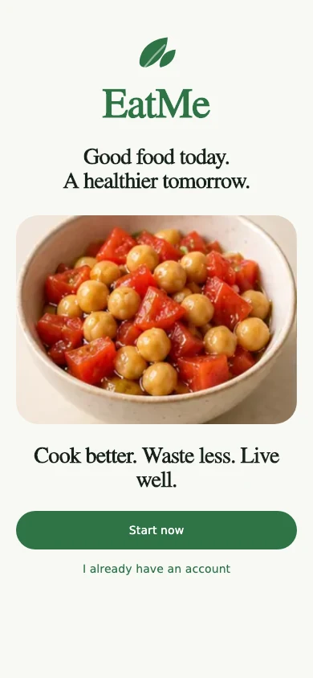 | 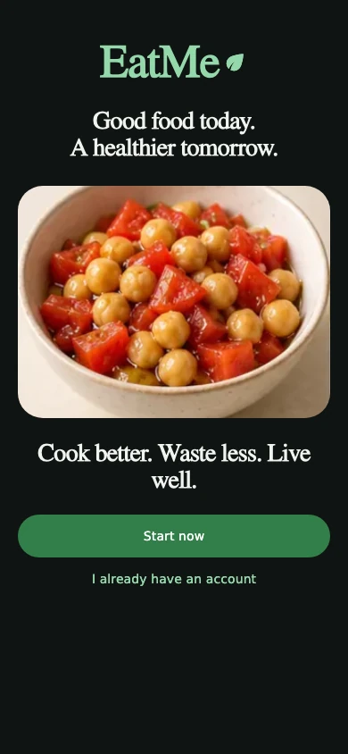 |
| Login | 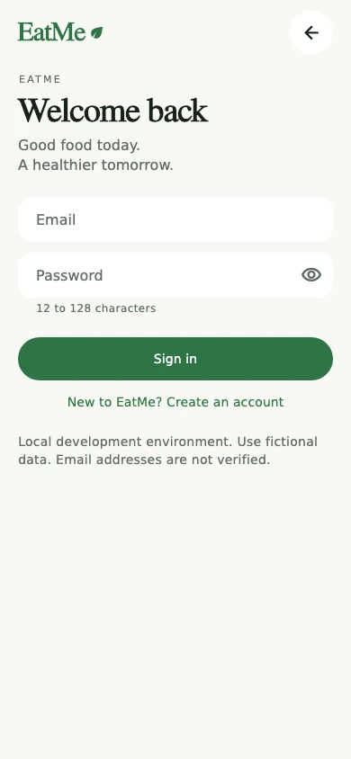 | 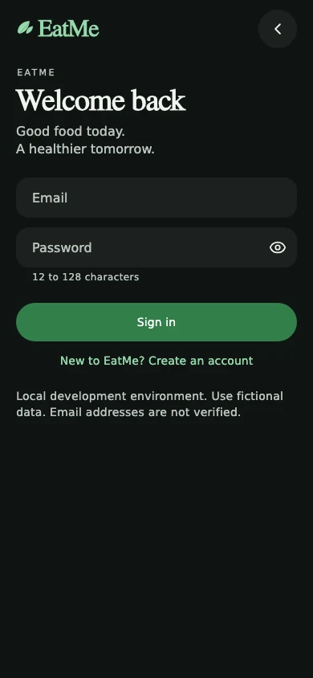 |
| Recipe detail | 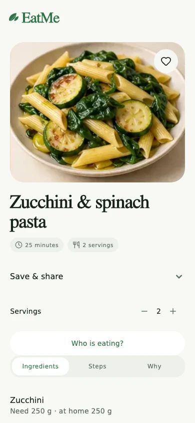 | 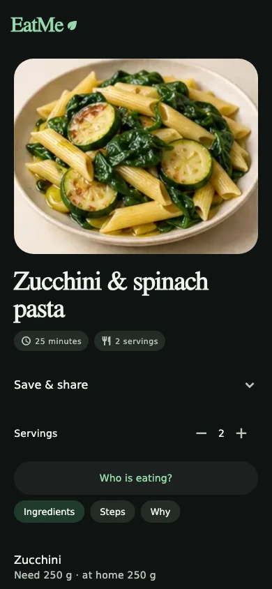 |
| Diet and health | 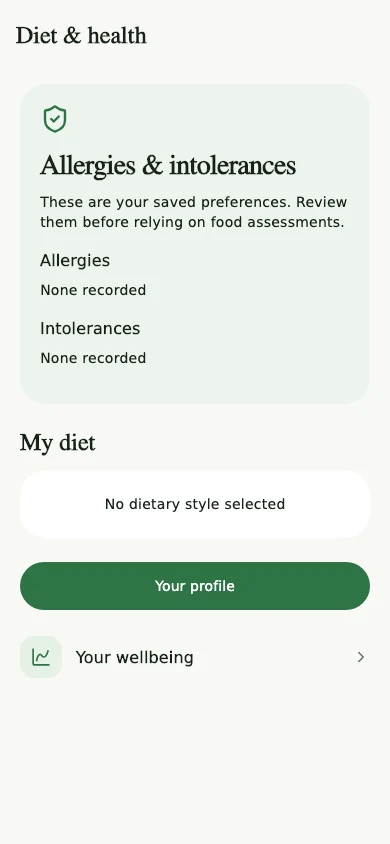 | 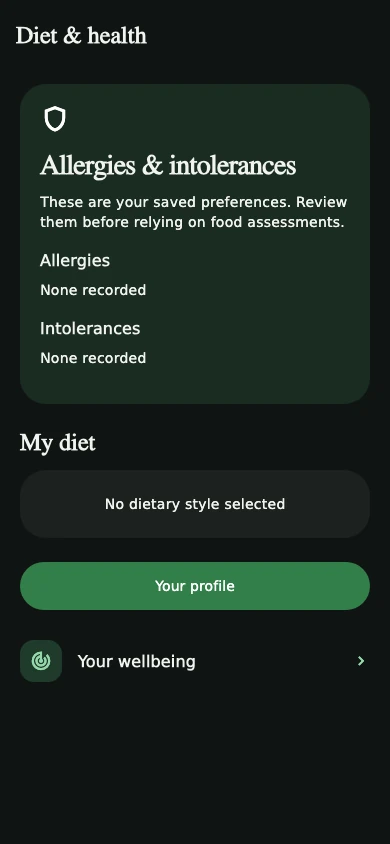 |
| Preferences | 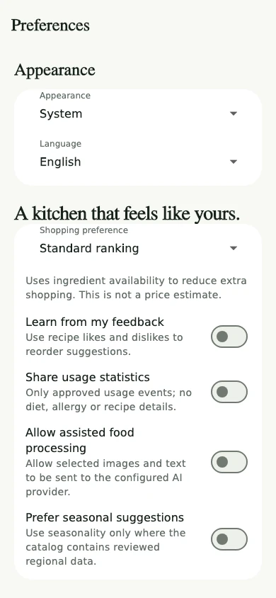 | 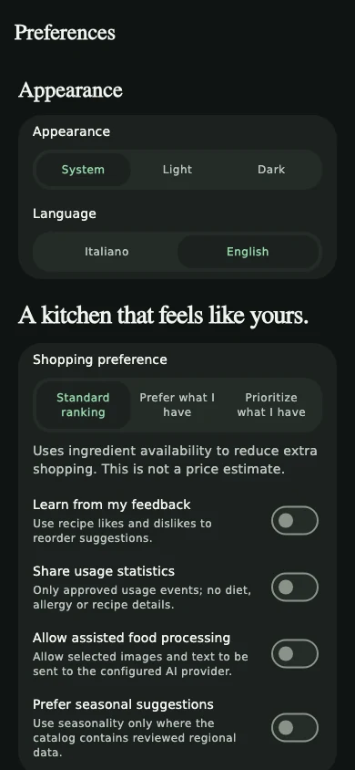 |
| Notifications | 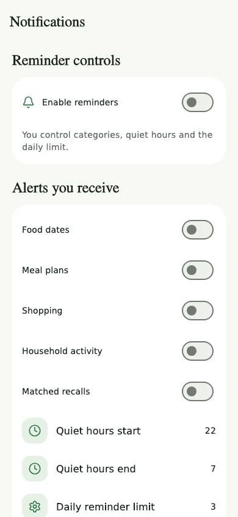 | 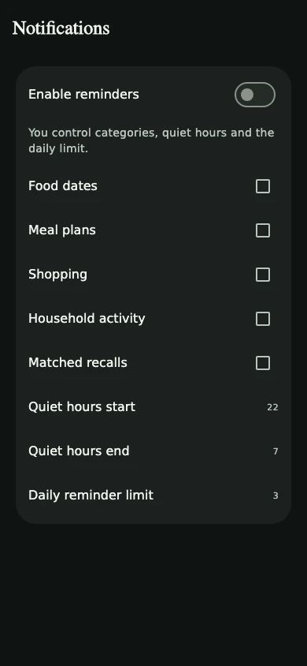 |
| Household | 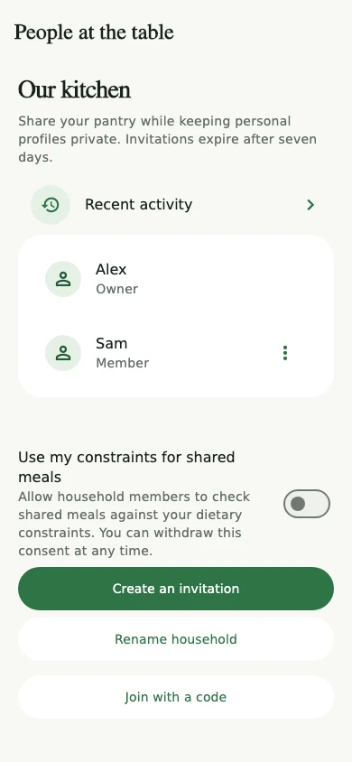 | 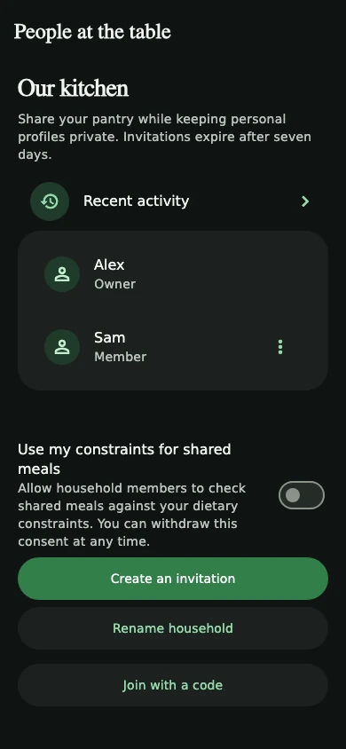 |
| Privacy and data | 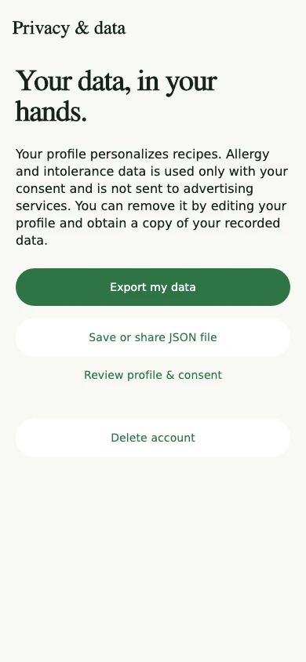 | 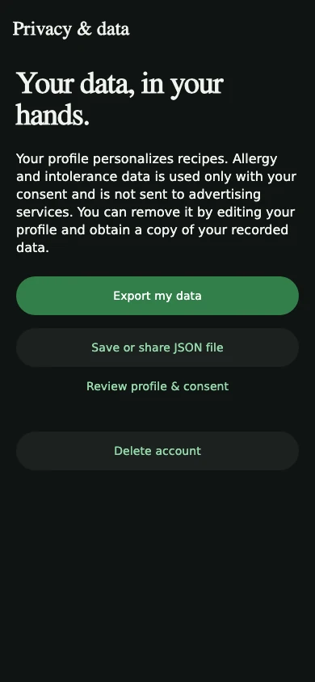 |
| Recipe filters | 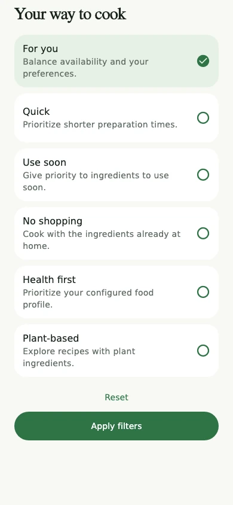 | 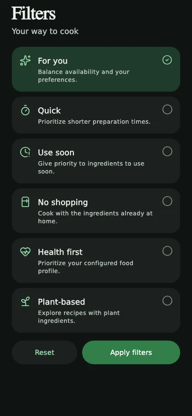 |
| Add ingredient | 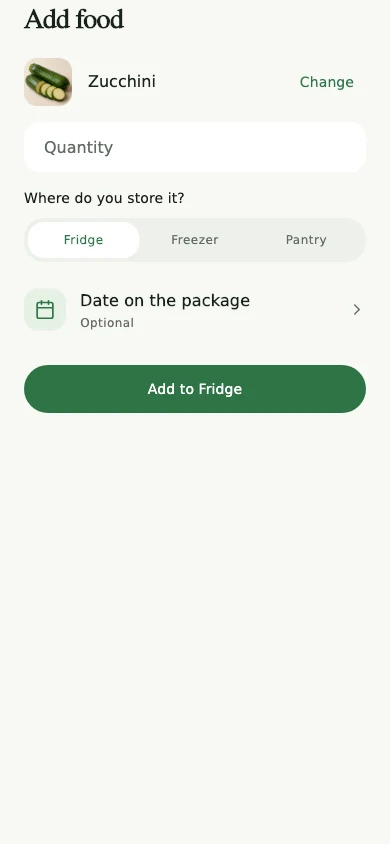 | 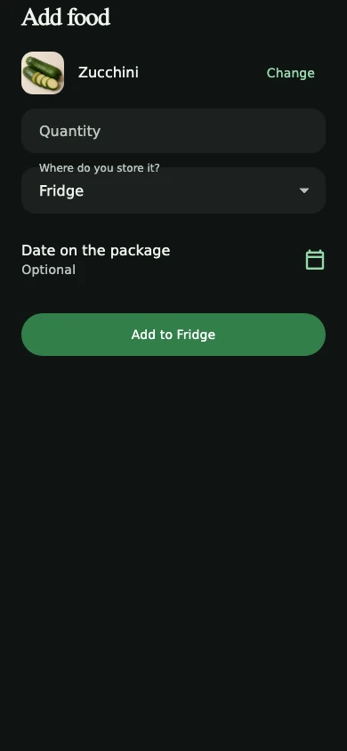 |
| Custom food | 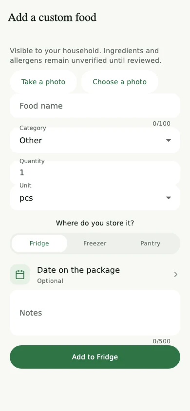 | 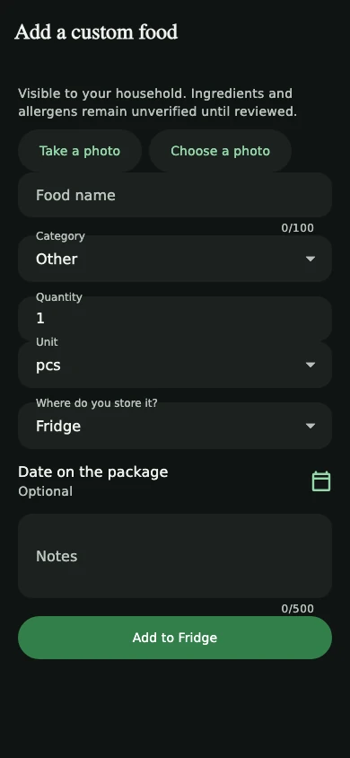 |
| Personal goals | 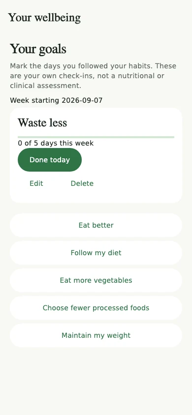 | 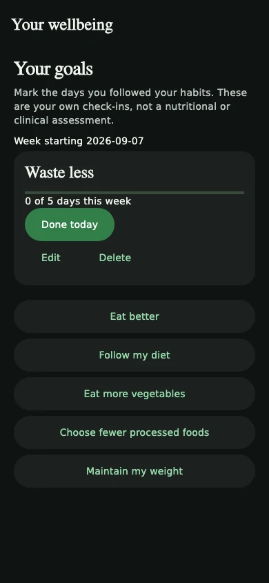 |

Regenerate with the repository-pinned Flutter SDK:

```bash
cd apps/mobile
flutter test test/visual_reference_test.dart test/premium_journeys_test.dart test/reference_features_test.dart
```

Renders are written to `build/screenshots/`. Tests also exercise larger text and compact Italian layouts; screenshots show the 1.0 text-scale fixture. CI retains native Android/iOS debug artifacts separately. These images are interface validation assets, not certified store-release screenshots.
